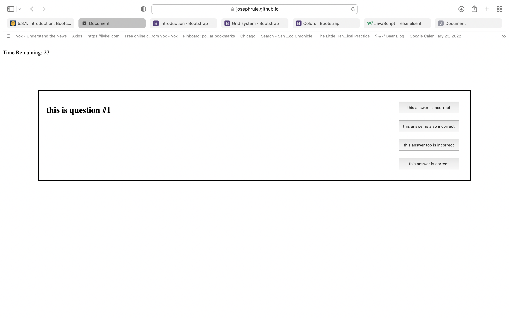

# code-quiz

This quiz web application demonstrates how to handle buttons, use local storage, and generate new elements using base javascript.

link to deployed application = https://josephrule.github.io/code-quiz/

screenshot
